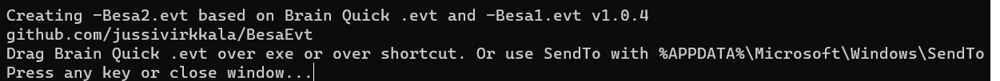

# BesaEvt

Creating -Besa2.evt based on Micromed Brain Quick .evt (xml) file together with Besa Research 7.1 -Besa1.evt (start of file). Result can be read into Besa Research. THE SOFTWARE IS PROVIDED "AS IS", WITHOUT WARRANTY OF ANY KIND...




Build .NET8 SDK (www.dot.net) into single win-x64 exe with following command.
```
dotnet publish -r win-x64 -c Release --self-contained true -p:PublishSingleFile=true -p:IncludeAllContentForSelfExtract=true
``` 


You can also download x64 Windows binary [BesaEvt.exe](BesaEvt.exe)


